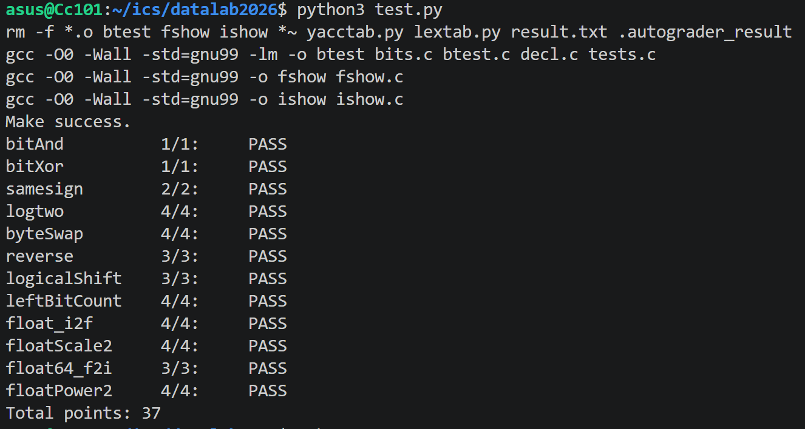

# datalab 报告

姓名：陈怡诺

学号：2020200679

| 总分 | bitAnd | bitXor | samesign | logtwo | byteSwap | reverse | logicalShift | leftBitCount | float_i2f | floatScale2 | float64_f2i | floatPower2 |
| --- | --- | --- | --- | --- | --- | --- | --- | --- | --- | --- | --- | --- |
| 37 | 1 | 1 | 2 | 4 | 4 | 3 | 3 | 4 | 4 | 4 | 3 | 4 |


test 截图：


<!-- TODO: 用一个通过的截图，本地图片，放到 imgs 文件夹下，不要用这个 github，pandoc 解析可能有问题 -->


## 解题报告

### 亮点

1. **byteSwap**：用 `diff = nb ^ mb` 构造差异掩码，一次性翻转两个字节中所有不同的位，直接完成交换，比常规“取出-清空-填回”更简洁，操作数远低于上限 17。
2. **samesign**：用 `!(!x ^ !y)` 把“0 既非正也非负”压缩进纯位运算，0 的处理和符号判断在同一层逻辑里完成，无分支、无额外变量。
3. **float_i2f**：舍入加数拆成 `(1 << (s-1)) - 1 + ((absv >> s) & 1)`，无分支实现 round-half-to-even，同时处理“四舍”和“五入”。


### bitAnd

```c
int bitAnd(int x, int y) {
    return ~(~x | ~y);
}
```

只允许 `~` 和 `|`，用德摩根律：`x & y = ~(~x | ~y)`。

### bitXor

```c
int bitXor(int x, int y) {
    return ~(~x & ~y) & ~(x & y);
}
```

异或 = “至少一个为 1”且“不同时为 1”。  
前半 `~(~x & ~y)` 表示至少一个为 1，后半 `~(x & y)` 表示不同时为 1，相与即得异或。

### samesign

```c
int samesign(int x, int y) {
    return !((x >> 31) ^ (y >> 31)) && !(!x ^ !y);
}
```

`x >> 31` 取符号位，异或后取非得“符号相同”。  
关键在 `!(!x ^ !y)`：

- `!x` 把“x 是否为零”变成 0/1；
- `!x ^ !y` 判断“是否一个为零一个不为零”；
- 再取 `!`，得到“要么都为零，要么都不为零”。

这样 0 的处理和符号判断在同一层逻辑里完成，无需 `if` 或额外变量，且符合“0 既非正也非负”的语义。

### logtwo

```c
int logtwo(int v) {
    int r = 0, s;
    s = (v > 0xFFFF) << 4; v >>= s; r |= s;
    s = (v > 0xFF)   << 3; v >>= s; r |= s;
    s = (v > 0xF)    << 2; v >>= s; r |= s;
    s = (v > 0x3)    << 1; v >>= s; r |= s;
    r |= (v > 1);
    return r;
}
```

`log2(v)` 即最高位 1 的位置。二分法：依次判断高 16、8、4、2、1 位是否全 0，累加位移量。

### byteSwap

```c
int byteSwap(int x, int n, int m) {
    int ns = n << 3, ms = m << 3;
    int diff = ((x >> ns) & 0xFF) ^ ((x >> ms) & 0xFF);
    return x ^ ((diff << ns) | (diff << ms));
}
```

取出两个字节求异或得 `diff`，其中为 1 的位就是两字节不同的位。  
把 `diff` 分别移回两个位置，再与 `x` 异或，**一次性翻转两个字节中所有不同的位**，等价于交换两字节。两字节相同则 `diff = 0`，`x` 不变。

这比常规“取出两个字节 → 清空原位置 → 移位填回”的写法更简洁，也更难想到：利用异或的“差异掩码”性质，把两处修改合并成一次异或。

### reverse

```c
unsigned reverse(unsigned v) {
    v = ((v >> 1) & 0x55555555u) | ((v & 0x55555555u) << 1);
    v = ((v >> 2) & 0x33333333u) | ((v & 0x33333333u) << 2);
    v = ((v >> 4) & 0x0F0F0F0Fu) | ((v & 0x0F0F0F0Fu) << 4);
    v = ((v >> 8) & 0x00FF00FFu) | ((v & 0x00FF00FFu) << 8);
    v = (v >> 16) | (v << 16);
    return v;
}
```

分治：依次交换相邻 1、2、4、8、16 位。每步用掩码取出奇偶部分，错位合并。

### logicalShift

```c
int logicalShift(int x, int n) {
    return (x >> n) & ~(((1 << 31) >> n) << 1);
}
```

`x >> n` 是算术右移，高位补了符号位。  
`((1 << 31) >> n) << 1` 生成高 n 位为 1 的掩码，取反后与结果相与，高 n 位清零。

### leftBitCount

```c
int leftBitCount(int x) {
    int n = 0, shift;
    x = ~x;
    shift = !(x >> 16) << 4; n += shift; x <<= shift;
    shift = !(x >> 24) << 3; n += shift; x <<= shift;
    shift = !(x >> 28) << 2; n += shift; x <<= shift;
    shift = !(x >> 30) << 1; n += shift; x <<= shift;
    shift = !(x >> 31);      n += shift; x <<= shift;
    n += !(x >> 31);
    return n;
}
```

取反后转为统计最高位起连续 0 的个数。二分法：依次判断高 16、8、4、2、1 位是否全 0，累加并左移。

### float_i2f

```c
unsigned float_i2f(int x) {
    unsigned sign = x & 0x80000000u;
    int absv, exp, frac, s;
    if (!x) return 0;
    if (x == 0x80000000) return 0xCF000000u;
    absv = sign ? -x : x;
    exp = 31;
    while (!((absv >> exp) & 1)) exp--;
    if (exp > 23) {
        s = exp - 23;
        frac = (absv + ((1 << (s - 1)) - 1) + ((absv >> s) & 1)) >> s;
        if (frac >> 24) exp++;
    } else {
        frac = absv << (23 - exp);
    }
    return sign | ((exp + 127) << 23) | (frac & 0x7FFFFF);
}
```

先取符号和绝对值，找到最高位 1 的位置 `exp`。  
`exp > 23` 时需舍入，舍入加数写成：

```c
(1 << (s - 1)) - 1 + ((absv >> s) & 1)
```

- `(1 << (s-1)) - 1`：让被丢弃部分大于等于半时自然进位（四舍）。
- `(absv >> s) & 1`：让恰好等于半时，根据保留位最低位决定是否进位（round-half-to-even）。

不用 `if`，只用算术完成舍入，同时覆盖了“四舍”和“五入”两种情况。进位导致 `frac >> 24` 时指数加 1。  
`exp <= 23` 时直接左移补齐尾数。最后拼成 `sign | exp | frac`。  
边界：`x = 0` 返回 0；`x = 0x80000000` 直接返回 `0xCF000000`。

### floatScale2

```c
unsigned floatScale2(unsigned uf) {
    unsigned sign = uf & 0x80000000u;
    unsigned exp = (uf >> 23) & 0xFF;
    unsigned frac = uf & 0x7FFFFF;
    if (exp == 255) return uf;
    if (exp == 0) return sign | (frac << 1);
    exp++;
    if (exp == 255) return sign | 0x7F800000u;
    return sign | (exp << 23) | frac;
}
```

乘 2 即指数加 1。  
`exp == 255` 为 NaN/Inf，原样返回；`exp == 0` 为非规格化数，尾数左移一位；否则 `exp++`，若溢出成 255 则返回 Inf。

### float64_f2i

```c
int float64_f2i(unsigned uf1, unsigned uf2) {
    unsigned sign = uf2 >> 31;
    unsigned exp = (uf2 >> 20) & 0x7FF;
    unsigned hi, result;
    int E, shift;
    if (!exp) return 0;
    E = exp - 1023;
    if (E < 0) return 0;
    if (E >= 31) return 0x80000000;
    hi = (1 << 20) | (uf2 & 0xFFFFF);
    shift = 52 - E;
    if (shift >= 32) result = hi >> (shift - 32);
    else result = (hi << (32 - shift)) | (uf1 >> shift);
    return sign ? -result : result;
}
```

从 `uf2` 拆出符号位和指数。`exp == 0` 返回 0；`E < 0` 下溢返回 0；`E >= 31` 溢出返回 `0x80000000`。  
构造尾数 `hi`，`shift = 52 - E` 为需右移位数，分 `shift >= 32` 和 `< 32` 两种情况拼接 `hi` 与 `uf1`，最后按符号返回。

### floatPower2

```c
unsigned floatPower2(int x) {
    if (x < -149) return 0;
    if (x > 127) return 0x7F800000u;
    if (x >= -126) return (x + 127) << 23;
    return 1 << (x + 149);
}
```

按范围分四种情况：太小返回 0，太大返回 `+INF`，规格化数指数为 `x + 127`，非规格化数尾数位为 `1 << (x + 149)`。

---

## 反馈/收获/感悟/总结

这个 lab 对我来说难度很大，花了很长时间。最大问题是上课听完完全不会下手，课上讲的是位运算基本规则，但 lab 要的是一套具体技巧库——德摩根律变形、常用掩码、二分法、分治、无分支舍入，课堂基本没展开，只能靠问 AI、看网课慢慢摸索。最基础的几道还能写，到了 `leftBitCount`、`float_i2f`、`float64_f2i` 就彻底卡住。

最大收获是：我觉得这种题灵机一动很难想出来，还是要依靠固定套路。把常用等价表示和掩码记牢，看到题才有思路。

<!-- 这一节，你可以简单描述你在这个 lab 上花费的时间/你认为的难度/你认为不合理的地方/你认为有趣的地方 -->

<!-- 或者是收获/感悟/总结 -->

<!-- 200 字以内，可以不写 -->

## 参考的重要资料

<!-- 有哪些文章/论文/PPT/课本对你的实现有重要启发或者帮助，或者是你直接引用了某个方法 -->

<!-- 请附上文章标题和可访问的网页路径 -->

1. 德摩根律：`~(x & y) = ~x | ~y`，`~(x | y) = ~x & ~y`。
2. IEEE 754 单精度/双精度浮点格式：sign / exponent / fraction 位布局。
3. 位运算技巧：`0x55555555` 取奇数位、`0x33333333` 取每 2 位低位等，用于 `reverse` 和 `leftBitCount`。